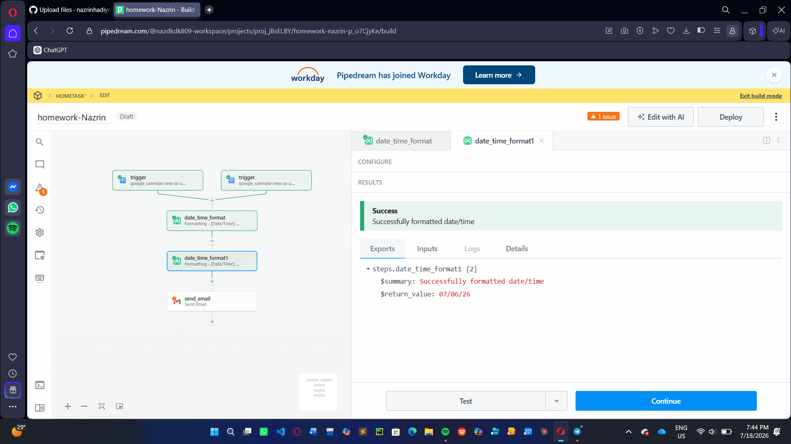

# 📅 Calendar Email Reminder

## 📖 Overview
This project automatically sends email reminders for upcoming calendar events using Pipedream.

## ✨ Features
- Detects upcoming calendar events
- Sends automatic email reminders
- Event-driven automation workflow

## 🛠️ Technologies
- Pipedream
- Google Calendar
- Email Integration

## 🎯 Purpose
This project was built to learn workflow automation and event-driven systems.
## 🚀 What I Learned

- Event-driven automation
- Workflow design with Pipedream
- Google Calendar integration
- Email automation
## 📸 Workflow

